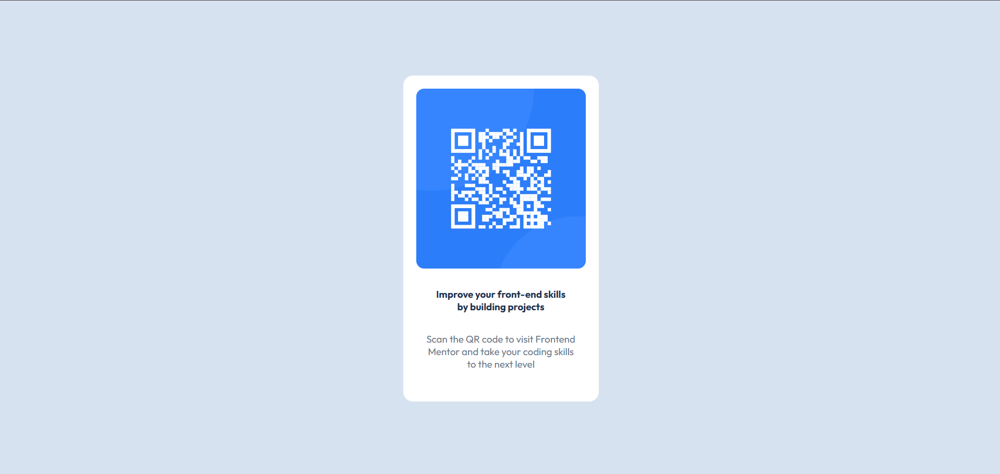

# Frontend Mentor - QR code component solution

This is a solution to the [QR code component challenge on Frontend Mentor](https://www.frontendmentor.io/challenges/qr-code-component-iux_sIO_H). Frontend Mentor challenges help you improve your coding skills by building realistic projects.

## Table of contents

- [Overview](#overview)
  - [Screenshot](#screenshot)
  - [Links](#links)
- [My process](#my-process)
  - [Built with](#built-with)
  - [What I learned](#what-i-learned)
- [Author](#author)

## Overview

### Screenshot



### Links

- Live Site URL: [Live Demo](https://eidghannam.github.io./QR-Component/)

## My process

### Built with

- Semantic HTML5 markup
- CSS custom properties
- Flexbox
- Mobile-first workflow

### What I learned

In this project, I reinforced my understanding of **Flexbox** for layout and **CSS custom properties** for theming. Additionally, I practiced using web fonts by integrating the "Outfit" font via Google Fonts.

Here's a code snippet I'm particularly proud of:

```css
body {
  width: 100%;
  height: 100vh;
  display: flex;
  justify-content: center;
  align-items: center;
  background-color: hsl(212, 45%, 89%);
}
```

## Author

- Frontend Mentor - [@eidghannam](https://www.frontendmentor.io/profile/eidghannam)

- GitHub - [@eidghannam](https://github.com/eidghannam)
